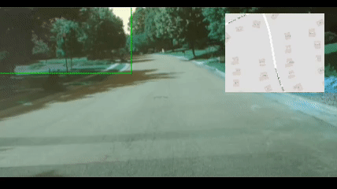
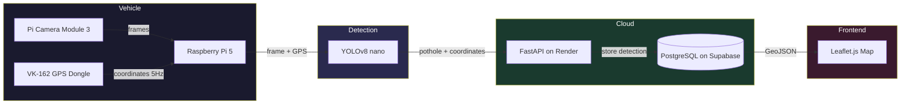

# Computer Vision Pothole Mapper


A real-time computer vision system that detects road potholes from a live camera feed mounted in a vehicle, geotags each detection using a hardware GPS module, and plots them on an interactive public map updated in real time.

**[View Live Map](https://cv-pothole-mapper.onrender.com)**

---

## Demo



---

## Screenshots

**Interactive map showing all detected potholes across Charlotte, color-coded by confidence level**


**Filtered view showing only low confidence detections from the past 7 days**


**Pothole detail popup showing confidence score, coordinates, and timestamp**


---

## How It Works

1. A **Raspberry Pi 5** mounted in a vehicle runs **YOLOv8 nano** inference on frames captured by a **Pi Camera Module 3 Wide**
2. A **Stratux VK-162 USB GPS dongle** provides real-time coordinates at 5Hz
3. When a pothole is detected above the confidence threshold, the Pi immediately POSTs the GPS coordinate and confidence score to a **FastAPI** backend over a phone hotspot
4. The backend logs the detection to a **PostgreSQL** database hosted on **Supabase**
5. A **Leaflet.js** map auto-refreshes every 30 seconds and supports real-time filtering by confidence level and time range

---

## Architecture



---

## Features

- **Real-time edge inference** — YOLOv8 nano running on Raspberry Pi 5 hardware
- **GPS-tagged detections** — sub-10-foot location accuracy at city driving speeds
- **Live public map** — color-coded markers by confidence level (red = high, orange = medium, gold = low)
- **Filtering** — filter by confidence level and time range with Apply/Reset controls
- **Persistent storage** — all detections stored in PostgreSQL, never lost between sessions
- **CI/CD** — GitHub Actions runs tests on every push

---

## Tech Stack

| Layer | Technology |
|-------|-----------|
| Detection | YOLOv8 nano, OpenCV, ultralytics |
| Hardware | Raspberry Pi 5 4GB, Pi Camera Module 3 Wide, Stratux VK-162 USB GPS |
| Backend | Python, FastAPI, SQLAlchemy, PostgreSQL |
| Database | Supabase (persistent, free tier) |
| Frontend | Leaflet.js, OpenStreetMap |
| Deployment | Render |
| CI/CD | GitHub Actions |

---

## Project Structure

```
CV-pothole-mapper/
├── detection/
│   ├── detector.py          # YOLOv8 inference wrapper
│   ├── video_processor.py   # Frame extraction from video files
│   └── gps_parser.py        # Real-time NMEA GPS parsing via pyserial
├── api/
│   ├── main.py              # FastAPI app entry point
│   ├── routes.py            # API endpoint definitions
│   ├── database.py          # SQLAlchemy models and DB connection
│   ├── schemas.py           # Pydantic request/response schemas
│   ├── config.py            # Centralized settings via pydantic-settings
│   └── logger.py            # Structured logging
├── pipeline/
│   ├── offline.py           # Post-processing pipeline for video files
│   └── realtime.py          # Live inference pipeline for Raspberry Pi
├── frontend/
│   ├── index.html           # Map UI with filter controls
│   └── map.js               # Leaflet.js map logic and filtering
├── scripts/
│   ├── seed_data.py         # Seed Charlotte neighborhood pothole data
│   ├── seed_data_485.py     # Seed I-485 loop pothole data
│   └── seed_highways.py     # Seed major highway pothole data
└── tests/
    ├── test_detector.py
    ├── test_video_processor.py
    └── test_gps_parser.py
```

---

## API Endpoints

| Method | Endpoint | Description |
|--------|----------|-------------|
| GET | `/api/potholes` | Returns all detections |
| POST | `/api/potholes` | Log a new pothole detection |
| DELETE | `/api/potholes/{id}` | Delete a specific pothole by ID |
| DELETE | `/api/potholes/location` | Delete potholes within a radius |
| DELETE | `/api/potholes` | Clear all detections |

Swagger UI available at `/docs`

---

## Local Setup

```bash
# Clone the repo
git clone https://github.com/calteeling/CV-pothole-mapper.git
cd CV-pothole-mapper

# Create virtual environment
python -m venv venv
source venv/bin/activate

# Install dependencies
pip install -r requirements.txt

# Configure environment
cp .env.example .env
# Edit .env and set DATABASE_URL to your PostgreSQL connection string

# Run the server
uvicorn api.main:app --reload
```

Open `http://localhost:8000` — model weights download automatically on first run from HuggingFace.

---

## Running the Pipeline

**Offline — process a video file:**
```bash
python -m pipeline.offline path/to/dashcam.mp4 --lat 35.2271 --lon -80.8431
```

**Real-time — live inference on Raspberry Pi:**
```bash
python -m pipeline.realtime
```

---

## Hardware Setup

| Component | Model |
|-----------|-------|
| Single Board Computer | Raspberry Pi 5 4GB |
| Camera | Raspberry Pi Camera Module 3 Wide |
| GPS | Stratux VK-162 USB GPS Dongle |
| Power | 12V car USB-C outlet (27W) |
| Connectivity | iPhone hotspot |

---

## Model Weights

Weights are downloaded automatically from HuggingFace on first run:

**Model:** `keremberke/yolov8n-pothole-segmentation`  
**Performance:** 99.5% mAP@50 | 84.9% Precision | 100% Recall  
**License:** CC BY 4.0

---

## Scope

Designed and optimized for city and suburban driving under 45mph — the speed range where road potholes are most common and where detection is most reliable given motion blur constraints at higher speeds.

---

## Insights

This was my first project combining hardware and software into a complete end-to-end application. Building it required bridging multiple domains that don't typically overlap in a single project — computer vision, embedded systems, REST API design, cloud deployment, and geospatial visualization.

Setting up the Raspberry Pi was one of the more challenging aspects of the project. Configuring the OS, SSHing from my laptop, cloning the repository, and wiring the camera and GPS module all had to work together seamlessly before a single line of application code could run. Getting the Pi Camera Module 3 and the VK-162 GPS dongle communicating with the detection pipeline at the same time, and having detections accurately geotagged in real time, was a rewarding integration challenge.

A note on the map data: the majority of potholes currently displayed were artificially seeded using sample coordinate data across Charlotte neighborhoods and major corridors. This was an intentional decision to showcase the map at full capacity without requiring hours of driving. The detection pipeline itself is fully functional, as shown in the demo, and real detections are being logged and mapped accurately when the system is deployed in a vehicle.

If I were to extend this project further, I would add a community voting feature similar to Waze, where users can flag a pothole as filled or no longer present. This would allow the map to stay current over time without requiring continuous re-scanning of every road, turning a detection tool into a living, community-maintained road condition database.